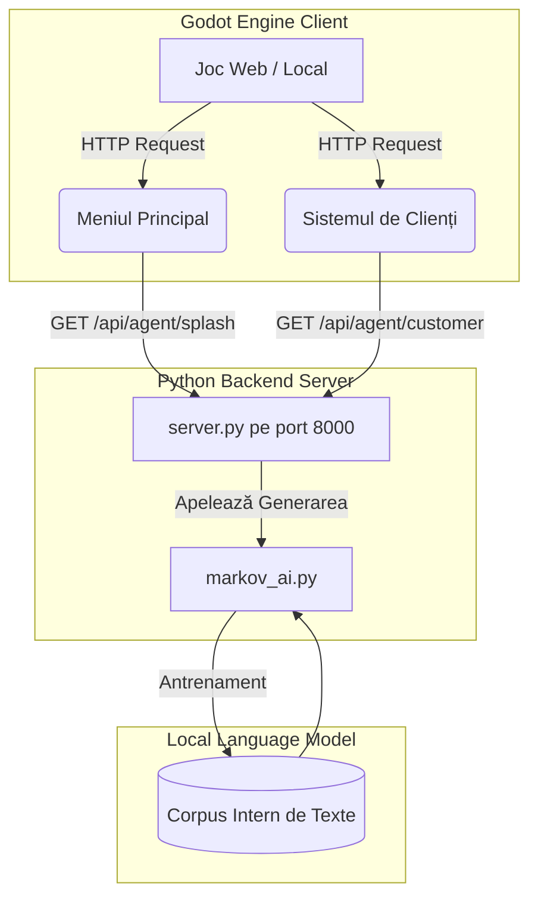
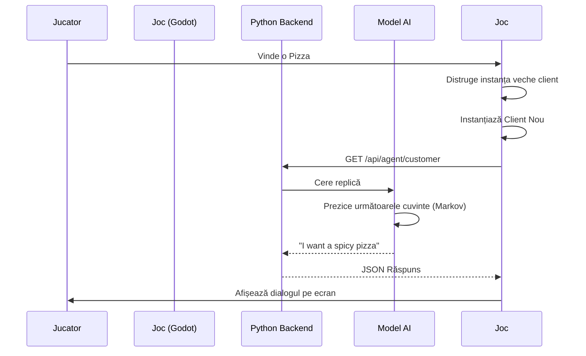
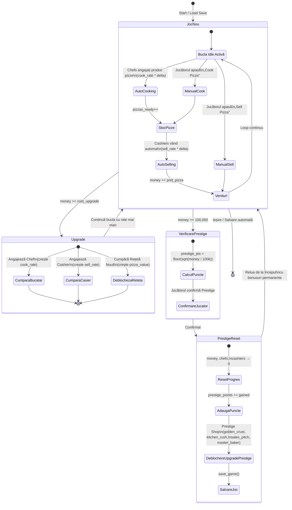

# Arhitectura Proiectului: Pizza Tycoon

Acest document descrie arhitectura aplicației și modul în care comunică diferitele componente.

## Arhitectura Componentelor
Diagrama de mai jos prezintă structura de bază a sistemului, inclusiv motorul de joc, serverul local de proxy, și logica agenților AI.

## Workflow: Servirea Clienților
Workflow-ul standard de joc, implicând atât interacțiunea jucătorului cât și generarea replicilor.

## Ciclul de Progresie & Prestige
Diagrama de stări descrie bucla principală a jocului idle, de la acumularea de resurse până la resetarea prin Prestige.

